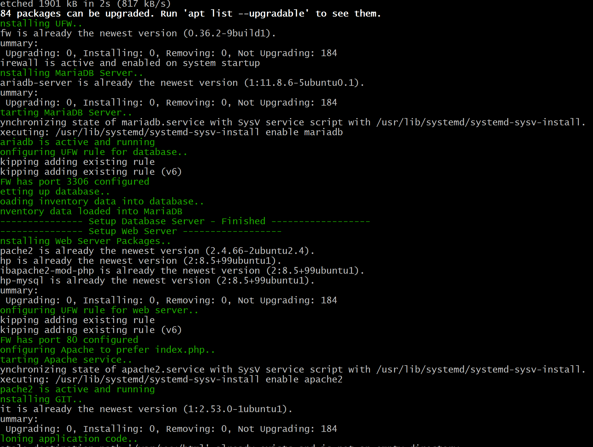
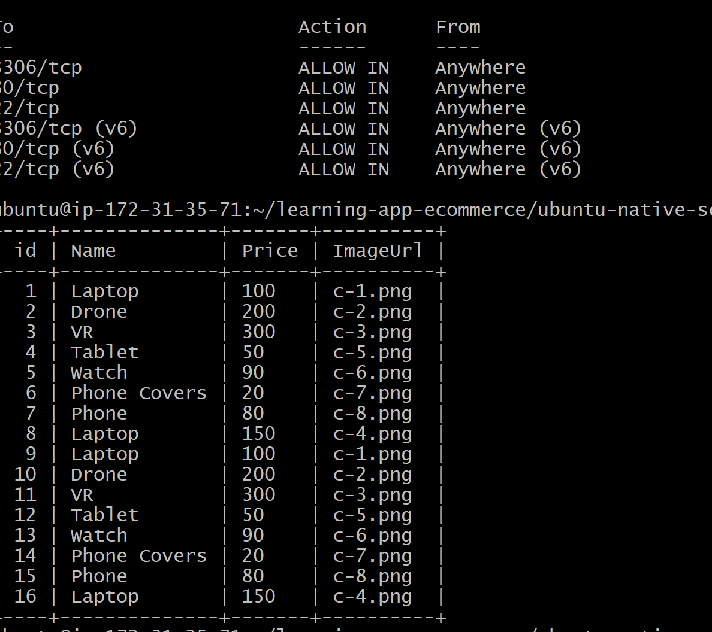

# shell-script-project-deploy-ecommerce-website

## E-Commerce Application Deployment Using a Shell Script

This is a fictional online store that sells electronic devices. It's a LAMP
stack application (Linux, Apache, MariaDB, PHP) that can be deployed on a
single Linux server node.

Repository: https://github.com/Ramya-R74/learning-app-ecommerce.git

---

## Screenshots





> **Note:** Update the file paths above to match the actual screenshot file
> names in your `assets/` folder.

---

## What the Script Does

The deployment script automates the full setup of the application on a
fresh server, end to end:

* Install, enable & start the firewall service
* Install, start & enable the Apache/httpd web server
* Configure the firewall rules for the web server
* Install, start & configure the MariaDB database service
* Configure the database config file (port settings, etc.)
* Enable the required firewall rule for the SQL port (3306) and reload
* Create the application database
* Create a database user and grant the appropriate access privileges
  using the MySQL command-line utility
* Load inventory data about the website's products into the database
  using an external SQL script
* Install the required packages for the website, including PHP and the
  PHP-to-MySQL connector
* Add the firewall rule to allow access to port 80 and reload the
  firewall configuration
* Configure the web server to use `index.php` as the default page
  instead of `index.html`
* Install `git` (if not already present) and clone the application code
  from GitHub
* Verify the deployment by testing that the site is serving product data

---

## Supported Platforms

This project includes two versions of the deployment script:

| Script | OS | Package Manager | Web Server | Firewall |
|---|---|---|---|---|
| `deploy-ecommerce.sh` | CentOS | `yum` | `httpd` | `firewalld` |
| `deploy-ecommerce-ubuntu.sh` | Ubuntu | `apt` | `apache2` | `ufw` |

---

## Prerequisites

* A fresh CentOS or Ubuntu server (tested on a single-node setup)
* `sudo`/root access
* Outbound internet access (to install packages and clone the repo)

---

## Usage

1. Clone this repository onto your server:
   ```bash
   git clone https://github.com/Ramya-R74/learning-app-ecommerce.git
   cd learning-app-ecommerce
   ```

2. Make the relevant script executable:
   ```bash
   chmod +x deploy-ecommerce-ubuntu.sh   # or deploy-ecommerce.sh for CentOS
   ```

3. Run it:
   ```bash
   sudo ./deploy-ecommerce-ubuntu.sh
   ```

4. Once the script finishes, open the site in your browser at:
   ```
   http://localhost
   ```

---

## Notes

* Database credentials used by the script (`ecomuser` / `ecompassword`)
  are for learning purposes only — change them before using this in any
  real environment.
* On a multi-node setup, update the `DB_HOST` value in the `.env` file
  to point to the database server's IP address instead of `localhost`.
